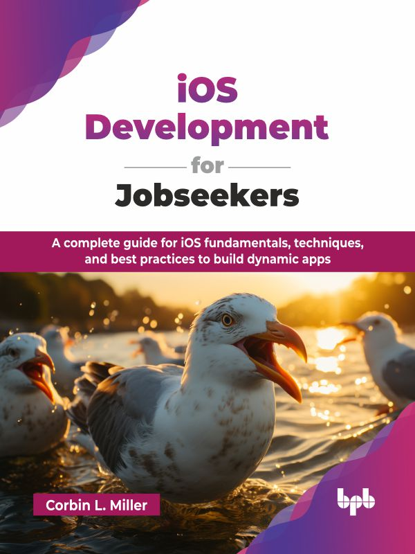

# iOS Development for Jobseekers

A complete guide for iOS fundamentals, techniques, and best practices to build dynamic apps.

This is the repository for [iOS Development for Jobseekers
](https://bpbonline.com/products/ios-development-for-jobseekers?variant=44592828547272),published by BPB Publications.

## About the Book
iOS development is a highly sought-after skill in today's tech industry, and this book, iOS Development for Jobseekers, is your direct pathway to mastering it and landing your dream job. It provides a solid foundation in Swift, Apple's SDKs, and essential architectural patterns, ensuring you are well-prepared for any iOS development interview.

Through structured chapters, readers will explore essential Apple frameworks, best coding practices, optimization strategies, debugging techniques, and career growth strategies to stand out in the increasingly competitive job market. The book examines advanced topics like ARKit, Core ML, app extensions, and master debugging with LLDB and Instruments. Furthermore, it details testing strategies, deployment, and corporate development environments, ensuring you understand the entire iOS development lifecycle from start to finish.

By the end of this book, you will be prepared to develop, build, test, deploy, and scale mobile applications while gaining the expertise needed to secure a job in the tech industry. With extensive code examples, technical insights, and career-focused advice, iOS Development for Jobseekers serves as an essential resource for success in mobile development.

## What You Will Learn
• Master Swift and Xcode to build professional iOS applications. 

• Develop, test, and debug apps for real-world mobile users. 

• Understand UI/UX design principles for iOS app interfaces. 

• Implement databases, APIs, and cloud services in apps. 

• Optimize app performance and ensure smooth user experiences. 

• Prepare for job interviews and succeed in the mobile industry.
